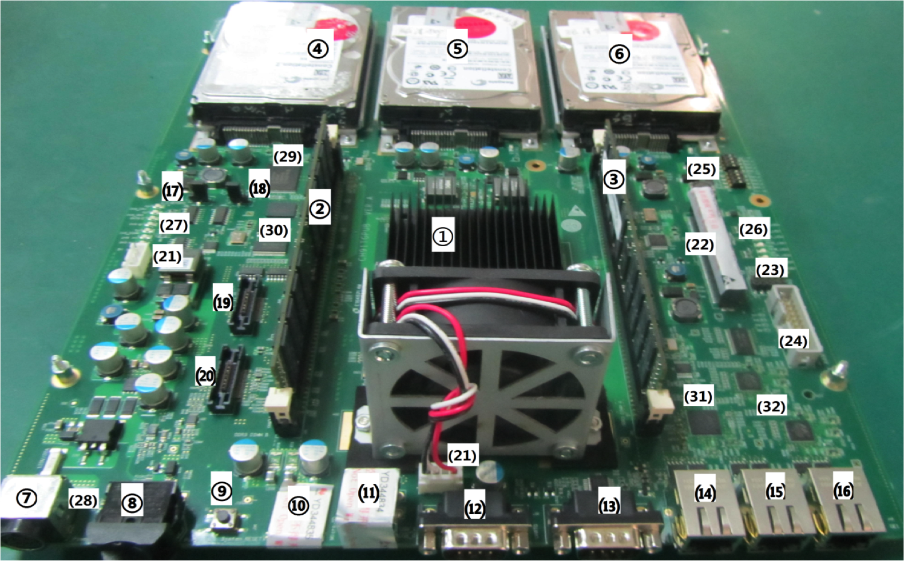

#Hisilicon Opensource Board D01 hacking manual

             .--,       .--,
            ( (  \.---./  ) )
             '.__/o   o\__.'
                {=  ^  =}
                 >  -  <
         ____.""`-------`"".___
        /                      \
        \                      /
        / Joy Xu               \
        \ xuwei5@hisilicon.com /
        /  V2.0                \
        \  2014-12-18          /
        /                      \
        \______________________/
              ___)( )(___
             (((__) (__)))

##Overview

* [D01 Board Hardware Featuers](#hardware)
* [D01 Software Solution and Status](#solution)
* [D01 Hacking](#hacking)

<a name="hardware"/>
##D01 Board Hardware Featuers

Major hardware features of D01 are listed here.  
         
        +---------------------------+--------------------------------------------------------------------------+
        |Features                   | Description                                                              |
        +---------------------------+--------------------------------------------------------------------------+
        |Processors                 | Integrated 16 x ARM Cortex-A15 CPU Core @ max. 1.5GHz                    |
        |                           | Support for up to 84000 DMIPS                                            |
        |                           | Support for CPU configuration as AMP/SMP                                 |
        |                           | Configurable Big or Littile endian,default Little endian                 |
        |                           | Support ARMv7-A instruction set                                          |
        |                           | Support float VFPv4 instruction set                                      |
        +---------------------------+--------------------------------------------------------------------------+
        |Memory                     | Two 64bit DDR3 DRAM Dual Inline Memory, Module(DIMM) sockets:(2)&(3)     |
        |                           | Maximum frequency of 1600 MHz                                            |
        |                           | Maximum capacity of 64GB                                                 |
        |                           | preassembled capacity:16GB                                               |
        |                           | Built-in two 1Gb NOR Flash; only one NOR flash could use by software:(29)|
        |                           | Built-in two 512MB NAND Flash:(30)                                       |
        +---------------------------+--------------------------------------------------------------------------+
        |GPU                        | None                                                                     |
        +---------------------------+--------------------------------------------------------------------------+
        |Peripheral Interfaces      | TWO USB2.0 Host port:(11)                                                |
        |                           | Two UART interfaces:(12)&(13)                                            |
        |                           | Four I2C interfaces                                                      |
        |                           | One SPI interface, supporting four CSs                                   |
        |                           | One SD card interface:(10)                                               |
        |                           | GPIO: eight LED interfaces:(26);eight switchs:(25)                       |
        |                           | Three SATA interfaces(2.5in SATA 3.0 6Gbps):(4)&(5)&(6)                  |
        |                           | Tracer Connector x2:(19)&(20)                                            |
        |                           | One JTAG interfaces( 5x2 pin CPU Connector, ARM Connector):(24)          |
        +---------------------------+--------------------------------------------------------------------------+
        |BIOS                       | BIOS resident in NOR Flash                                               |
        |                           | Support for update with FTP                                              |
        +---------------------------+--------------------------------------------------------------------------+
        |LAN                        | Two 10/100/1000Mbit/s Gigabit Ethernet ports:(15)&(16)                   |
        |                           | One 10/100Mbit/s FE port:(14)                                            |
        +---------------------------+--------------------------------------------------------------------------+
        |Hardware Monitor Subsystem | Power consumption sense                                                  |
        +---------------------------+--------------------------------------------------------------------------+
        |Input Devices              | None                                                                     |
        +---------------------------+--------------------------------------------------------------------------+
        |Other                      | One hardware button for power-off:(8)                                    |
        |                           | One hardware button for reset:(9)                                        |
        +---------------------------+--------------------------------------------------------------------------+

<a name="pic"/>
Refer to the following picture to know where each component below is physically located.    

 

<a name="solution"/> 
##D01 Software Solution and Status 

The software architecture on D01 is like following:

* [Toolchain](#toolchain)

          +--------------------------+ +-----+
          |  NANDRootfs Ubuntu       | |  T  |
          |  OpenSuse Debian Fedora  | |  o  |
          +--------------------------+ |  o  |
          |         Kernel           | |  l  |
          +-----------+              | |  C  |
          |    GRUB   |   EFI-STUB   | |  h  |
          +----+------+--------+-----+ |  a  |
          |    |  BootWrapper  |     | |  i  |
          |    +---------------+     | |  n  |
          |           UEFI           | |     |
          | +-------+-------+-----+  | |     |
          | | NANDC | SATAC | PXE |  | |     |
          | +-------+-------+-----+  | |     |
          +--------------------------+ +-----+

<a name="release"/>
And you could download the binary from the link:

        https://github.com/hisilicon/boards/tree/master/D01/release

Linaro also provide a monthly release for it:

         http://www.linaro.org/downloads/ 

###The function of each component

<a name="uefi"/>
* [UEFI](http://uefi.org/about): responsible for loading and booting kernel  

    could get the source code from following git tree

        https://github.com/hisilicon/UEFI.git
        https://git.linaro.org/landing-teams/working/hisilicon/uefi.git
        https://git.linaro.org/uefi/linaro-edk2.git

    And could download monthly binary from:

        http://releases.linaro.org/latest/components/kernel/uefi-linaro

<a name="bootwrapper"/>
* BootWrapper: responsible for switching into HYP mode for slave cores  

    could get the source code from following git tree

        https://github.com/hisilicon/bootwrapper.git

    And it is based on following git tree:

        https://git.linaro.org/arm/models/boot-wrapper.git
        https://github.com/virtualopensystems/boot-wrapper.git

<a name="grub"/> 
* [GRUB](http://www.gnu.org/software/grub/): responsible for loading kernel 

    could get the source code from following git tree

        https://github.com/hisilicon/grub.git

    And it is based on Leif's grub: `http://bazaar.launchpad.net/~leif-lindholm/linaro-grub/arm-uefi`  
    I have confrimed that we could not use the mainline grub: `git://git.savannah.gnu.org/grub.git`

<a name="stub"/>
* EFI-STUB: responsible for adding PE HEAD into Kernel Image and making it like   
    a UEFI application.  

    In this case, UEFI could directly load and boot the kernel  
    from the **FAT32 partion**(because our UEFI SATA driver could only support this type)  
    in the harddisk without **GRUB**.

 <a name="kernel"/>
* [kernel](http://www.kernel.org): our operate system

    could get the source code from following git tree

        https://github.com/hisilicon/linux-hisi.git tag:D01-3.18-release

        https://git.linaro.org/landing-teams/working/hisilicon/kernel.git 
        branch: integration-hilt-linux-linaro or integration-hilt-working-v3.14

        https://git.linaro.org/kernel/linux-linaro-tracking.git
        https://git.kernel.org/pub/scm/linux/kernel/git/torvalds/linux.git

    Most of the featuers have already merged into kernel mainline.   
    But some of features is not accepted like: Ethernet driver and so on.  
    Following is the commits list need to maintain by ourselves

        791a2af hip04: dts: update eth resource
        a162505 hip04: dts: add mdio resource
        90edc4d hip04: dts: add ether resource
        bbdab0b hip04: serdes: fix build error due to macro __DATE__
        2d326b0 misc: add sirdes driver

    And you could run following commands to pick them up:

        git cherry-pick --strategy recursive -X theirs 2d326b0
        git cherry-pick bbdab0b
        git cherry-pick --strategy recursive -X theirs 90edc4d
        git cherry-pick --strategy recursive -X theirs a162505
        git cherry-pick --strategy recursive -X theirs 791a2af

* Linux Distributions: each distribution is downloaded from itself website or from Linaro.

        +-----------+----------------------------------------------------------------+
        |  Ubuntu   |  http://releases.linaro.org/latest/ubuntu                      |
        +-----------+----------------------------------------------------------------+
        |  OpenSuse |                                                                |
        +-----------+----------------------------------------------------------------+
        |  Fedora   |                                                                |
        +-----------+----------------------------------------------------------------+
        |  Debian   |                                                                |
        +-----------+----------------------------------------------------------------+

    But the NAND Rootfs is created by ourselves and it could download from:
        
        https://github.com/hisilicon/boards/blob/master/D01/release/.filesystem
        http://releases.linaro.org/latest/ubuntu/boards/lt-d01/.filesystem

<a name="toolchain"/>        
* ToolChain: used to compile and debug and downdload from  

        http://releases.linaro.org/14.09/components/toolchain/binaries/gcc-linaro-arm-linux-gnueabihf-4.9-2014.09_linux.tar.xz       

<a name="hacking"/> 
##D01 Hacking                                                                                        

* [UEFI hacking](#uefihacking)
    
    * [how to compile D01 UEFI](#compileuefi)
    * [boot D01 to UEFI shell](#uefishell)
    * [upgrade UEFI](#upgradeuefi)
    * [how to restore the UEFI when the UEFI did not work](#restoreuefi)

* [Kernel hacking](#kernelhacking)

<a name="uefihacking">
###UEFI hacking 

<a name="compileuefi">
####how to compile D01 UEFI 

<a name="uefishell"/> 
####boot D01 to UEFI shell(EBL)                                                                         

1. Make sure Jumper J39 is in position 1 and 2.(This means to use custom UEFI.  
If position 2 and 3 are connected, it will boot with the default UEFI, which can never be flashed.)

2. Serial console (Connector UART0): 115200/8/N/1

3. Ethernet (FE, J44)

4. The board is shipped with a power adapter. Apply it to the board, and turn it on.
You should be able to see output in serial console now.

5. Keep pressing 's' in minicom or other serial terminal to start UEFI Boot Menu.
Select [b] EBL. Type in 'help' to see all commands supported in EBL.

<a name="upgradeuefi"/>
####upgrade UEFI 

1. download [`D01.fd`](#release) the UEFI binary file or [compile](#compileuefi) it by yourself

2. copy the `D01.fd` to the FTP server

3. [Enter EBL](#uefishell) as described above. 

4. Type in these commands: 
       
		IP address config:
			> ifconfig -s eth0 [IP.address] [mask] [gateway]
			  eg. ifconfig -s eth0 192.168.10.155 255.255.255.0 192.168.10.1
		download from FTP server (Note, filename must be EFI-BOOT.fd)
			> provision [server.IP] -u [user.name] -p [passwd] -f EFI-BOOT.fd
			  eg. provision 192.168.10.6 -u dj -p dj -f EFI-BOOT.fd
		flash to NOR:
			> updateL1 EFI-BOOT.fd

5. reboot the D01 board

<a name="restoreuefi"/>
####how to restore the UEFI when the UEFI did not work 

In case of failure in UEFI, you can always switch to a factory default (known-good, non-erasable) UEFI  
by shorting Pin 2 and Pin 3 of J39. (Refer to Mark 18 of [d01-portrait.png](#pic))

1. Power off the board, disconnect power supply

2. Short Pin 2 and Pin 3 of J39 (Leave Pin 1 unconnected)

3. On your client (minicom or similar tools), change UART baudrate to 9600 or 115200

4. Apply power to the board, turn it on

5. Following above steps to [upgrade UEFI](#upgradeuefi)

6. Power off the board, disconnect power supply

7. Short Pin 1 and Pin 2 of J39 (Leave Pin 3 unconnected)

8. On your client, change UART baudrate to 115200. (That's usually the case. Unless you know that you are using a 9600 baudrate UEFI.)

<a name="kernelhacking"/>
###how to burn kernel
* [compile kernel source code](#compilekernel)
* [upgrade kernel](#upgradekernel)
* [change kernel command line in UEFI](#changecommandline)

####download compiled kernel

1. Download default image from [linaro release](http://releases.linaro.org/14.02/ubuntu/saucy-hwpacks/lt-d01), and save them in FTP server's ftp root directory.  
There are total 4 files:

		filename		|	description
		.filesystem		|	initramfs
		.text			|	boot-wrapper
		.monitor		|	monitor mode
		.kernel			|	zImage, with dtb concatenated

<a name="compilekernel"/>
####compile kernel source code

1. download kernel source code from [linaro hisilicon public git](ssh://git@git.linaro.org/landing-teams/working/hisilicon/kernel.git)

2. use following command to compile:

		make  ARCH=arm CROSS_COMPILE=arm-linux-gnueabi- O=../linux-next.build hip04_defconfig
		make  ARCH=arm CROSS_COMPILE=arm-linux-gnueabi- O=../linux-next.build -j8 zImage
		make  ARCH=arm CROSS_COMPILE=arm-linux-gnueabi- O=../linux-next.build hip04-d01.dtb
		cat ../linux-next.build/arch/arm/boot/zImage ../linux-next.build/arch/arm/boot/dts/hip04-d01.dtb > /$(FTP-server-path)/.kernel

<a name="upgradekernel"/>
####upgrade kernel
Boot D01 to UEFI shell. And in EBL, type in these commands:

1. IP address config:
        > ifconfig -s eth0 [IP.address] [mask] [gateway]
          eg. ifconfig -s eth0 192.168.10.155 255.255.255.0 192.168.10.1

2. download files from FTP server (Note, filenames must not be changed):  
Note, there are four files, .kernel .filesystem .text .monitor.

        > provision [server.IP] -u [user.name] -p [passwd] -f .text
        > provision [server.IP] -u [user.name] -p [passwd] -f .monitor
        > provision [server.IP] -u [user.name] -p [passwd] -f .filesystem
        > provision [server.IP] -u [user.name] -p [passwd] -f .kernel
          eg. provision 192.168.10.6 -u dj -p dj -f .monitor

3. Reboot D01

<a name="changecommandline"/>
####show & change kernel command line in UEFI

1. Boot D01 and enter EBL.

2. Use `getlinuxatag` to see current kernel parameter:

        > getlinuxatag

3. Use `changelinuxatag` to change kernel cmdline to this:

        > changelinuxatag
          ...
          console=ttyS0,115200 initrd=0x10d00000,0x1800000 rdinit=/linuxrc earlyprintk
          ...

4. Use setlinuxatag to save to FLASH
        > setlinuxatag

5. Reboot D01 

# Install NFS (Network filesystem), and Boot

Before doing that, please make sure you have UEFI, .text, .monitor, and .kernel installed on your D01.   
Please refer to above on steps of how to do that. (.filesystem is not necessary because kernel will boot with filesystem on network).  
On your local env., Choose a machine and use it as NFS server.   
Enable NFS service on it. Please follow the guide of your host Machine on how to do this.  

1. Download Ubuntu NFS server image release for D01 from [linaro release](http://snapshots.linaro.org/ubuntu/images/server/latest)

2. Extract this file. Export this path in NFS's config.

3. On D01 board, Boot up the board, and enter UEFI EBL shell.

4. Follow above step to update kernel cmdline. Change kernel cmdline to:
		
		console=ttyS0,115200 earlyprintk rootfstype=nfsroot root=/dev/nfs rw nfsroot=<NFS-server-ip>:<path-to-exported-NFS-files> ip=<client-ip>:<NFS-server-ip>:<gw-ip>:<netmask>::eth0:on:<dns0-ip>:<dns1-ip> user_debug=31 nfsrootdebug

	Here is an example:

		console=ttyS0,115200 earlyprintk rootfstype=nfsroot root=/dev/nfs rw nfsroot=192.168.0.108:/Users/docularxu/Downloads/mnt ip=192.168.0.150:192.168.0.108:192.168.0.1:255.255.255.0::eth0:on:192.168.0.1:8.8.8.8 user_debug=31 nfsrootdebug

	Note, this is an example. Please change the values according to your local environment.
	Explanation of each parameter can be found in kernel source Documentations. 
	Like:
 
		ip=<client-ip>:<server-ip>:<gw-ip>:<netmask>:<hostname>:<device>:<autoconf>:<dns0-ip>:<dns1-ip>

5. Reboot the board.

	After kernel boots and the Console shell is shown up, this means the process is successful.   
	It is recommended to config DNS server, so your board can access the Internet.   
	sudo to edit this file /etc/resolv.conf, and add your DNS server into it. Eg.  
	
		nameserver 192.168.0.1

# Install Ubuntu Server to SATA disk, and Boot

1. Download Ubuntu server release for D01 from [linaro release](http://snapshots.linaro.org/ubuntu/images/server/latest)

2. Boot the board with NFS

3. Partition and Format SATA disk. Create one ext4 partition of at least 10G to host the root filesystem. 

		In my case, it is /dev/sda1
		Mount /dev/sda1 to /mnt/sda1
		mkdir /mnt/sda1 /mnt/sda3
		mount -t ext4 /dev/sda1 /mnt/sda1

4. Extract release from Step 1 to /mnt/sda1

5. Unmount /dev/sda1

6. Reboot, and enter UEFI EBL shell.

7. Change kernel cmdline. Refer to above for details how-to.

		console=ttyS0,115200 root=/dev/sda1 rootfstype=ext4 rw earlyprintk ip=192.168.0.150:192.168.0.108:192.168.0.1:255.255.255.0::eth0:on:192.168.0.1:8.8.8.8

	Note, you should change /dev/sda1 to according to your SATA disk situation.

8. Reboot the board.
	After kernel boots and the Console shell is shown up, this means the process is successful.   
	It is recommended to config DNS server, so your board can access the Internet.   
	sudo to edit this file /etc/resolv.conf, and add your DNS server into it. Eg.  
	
		nameserver 192.168.0.1

